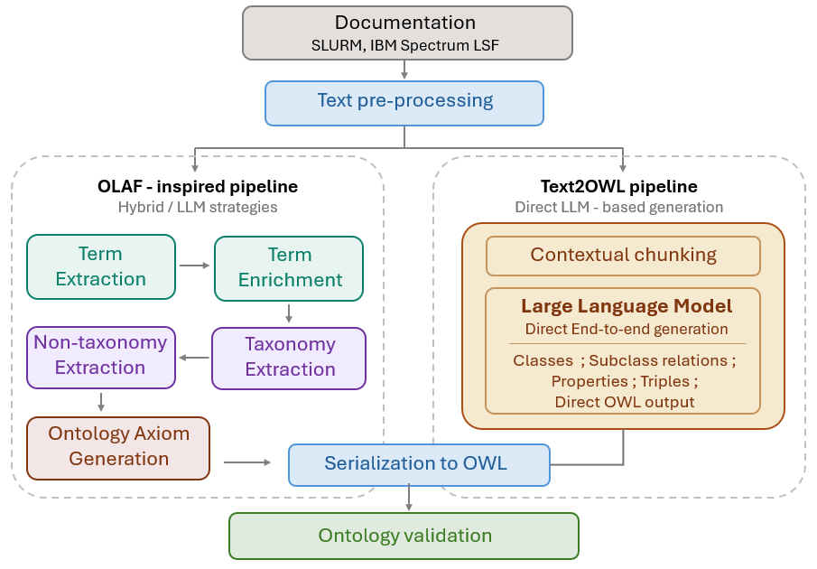

# LLM-Assisted Ontology Learning for HPC Workload Management Systems
This project builds and compares automated ontology learning pipelines for High-Performance Computing (HPC) workload manager documentation. The system extracts concepts, taxonomic relations, non-taxonomic relations, and OWL ontology structures from technical documentation such as **SLURM** and **IBM Spectrum LSF**. The main goal is to evaluate how different ontology learning strategies perform on complex, semi-structured HPC documentation in terms of coverage, structural consistency, semantic quality, and reasoning.

## System Architecture
The framework follows a staged workflow for generating ontologies from SLURM and IBM Spectrum LSF documentation. After preprocessing, the same prepared corpus is processed through two ontology construction directions:
1. **OLAF-based**: Extracts terms, taxonomies, non-taxonomic relations, and axioms step by step.
2. **Text2OWL-based**: Uses contextual chunks to generate ontology elements directly with an LLM.
<p align="center">
  
</p>
The outputs from all strategies are transformed into OWL-compatible ontologies and evaluated using the same validation criteria.

## Approaches Compared
1. **OLAF Hybrid**: This approach combines classical NLP, statistical methods, rule-based filtering, and LLMs support. It follows an OLAF workflow controlled pipeline to extract and enrich terms, building taxonomies, extracting relations, and generating ontology axioms. This approach focuses on reproducibility, traceability, and structural consistency.
2. **OLAF LLM**: This approach keeps the staged OLAF workflow but uses the LLM more actively across ontology learning tasks. The model supports concept identification, enrichment, taxonomy construction, relation extraction, and axiom generation through task-specific prompts. This approach tests whether LLM-based semantic interpretation improves when it is guided by explicit ontology learning stages.
3. **Text2OWL**: This approach represents the direct LLM-based generation strategy. It uses contextual chunks and prompts to directly generate OWL-compatible ontology structures. This approach is useful for comparing staged ontology learning with direct end-to-end generation.

## Pipeline Overview
The main stages of the project are:
1. **Documentation Collection**: SLURM and IBM Spectrum LSF documentation is collected and converted into text format.
2. **Text Preprocessing**: The raw documentation is cleaned, normalized, segmented, lemmatized, and divided into contextual chunks.
3. **Term Extraction and Enrichment**: Candidate domain concepts are extracted and normalized to reduce duplicates and improve consistency.
4. **Taxonomy Extraction**: Hierarchical is-a relations are identified and converted into subclass relations.
5. **Non-Taxonomy Extraction**: Domain-specific relations such as runs on, uses, allocates, or contains are extracted.
6. **Axiom Generation**: Extracted concepts and relations are converted into OWL classes, properties, domain/range constraints, and other ontology elements.
7. **OWL Serialization and Validation**: The generated ontology is exported in Turtle/OWL format and evaluated using structural, schema-level, logical, and sample-based checks.

## Project Structure
```
Final_project/                   
├── pre_processing/            # Cleaning, preprocessing, and contextual chunking
├── pipeline/                  # End-to-end pipeline execution
├── olaf/                      # OLAF Hybrid pipeline modules
├── olaf_llm/                  # LLM-assisted ontology learning modules
├── text2owl/                  # Direct Text2OWL generation and OWL output
├── evaluate/                  # Evaluates ontologies and produces reports
├── requirements.txt
├── .dockerignore
└── README.md
```
## Installation  
**Clone the repository:**
```
git clone https://github.com/meghana1711/Final_project.git   
cd Final_project
```
### Docker Setup
The project is designed to run inside Docker so that the same environment can be reused across different machines. The repository includes a development and cuda Docker image that mounts the local project folder into the container.

#### Build the Development Docker Image
After cloning the repository, build the Docker image. This creates a Docker image named final_project:dev /(:cuda for gpu).
```
docker build -f Dockerfile.dev -t final_project:dev /(:cuda for gpu).
```

#### Run Commands inside Docker
**The general command format is:**
docker run --rm -it -v "${PWD}:/app" -w /app final_project:dev/cuda

**Explanation:**
- `--rm` removes the container after the command finishes.
- `-it` runs the container in interactive mode.
- `-v` "${PWD}:/app" mounts the current project folder into the container.
- `-w /app` sets the working directory inside the container.
- `final_project:dev` / `final_project:cuda` is the Docker image name.
- `command` is the Python command to run.

**Usage:**
1. Run the Full Ontology Learning Pipeline
```
docker run --rm -it -v "${PWD}:/app" -w /app final_project:dev python -m pipeline.pipeline_ontology --db onto_db/slurm.db --input data/slurm --next olaf_hybrid --out_dir_root output/slurm_output --axiom_out_dir axiom_slurm_hybrid --stop_on_fail
```
2. Run Ontology Evaluation
```
docker run --rm -it -v "${PWD}:/app" -w /app final_project:dev python -m eval.evaluation --ttl output/slurm_output/axiom_slurm_llm/hpc_ontology.ttl --report report_final/llm_slurm.md --concept-eval-csv precision/llm_slurm/concept.csv --taxonomy-eval-csv precision/llm_slurm/taxonomy.csv --relation-eval-csv precision/llm_slurm/non_taxonomy.csv
```
**The command takes the following arguments:**
- `--db` sets the SQLite database path where intermediate and final pipeline outputs are stored.
- `--input` sets the input folder containing the `.txt` documentation files.
- `--next ` tells the runner to execute the **olaf_hybrid**, **olaf_llm** or **text2owl** pipeline after preprocessing.
- `--out_dir_root` sets the root folder where generated outputs are saved.
- `--axiom_out_dir` sets the subfolder where generated OWL/Turtle ontology files are saved.
- `--stop_on_fail` stops the pipeline if any step fails.
- `--ttl` path to the generated ontology file in Turtle format.
- `--report` path where the evaluation report should be saved.
- `--concept-eval-csv` manual annotation file for concept precision.
- `--taxonomy-eval-csv` manual annotation file for taxonomy precision.
- `--relation-eval-csv` manual annotation file for non-taxonomic relation precision.

### Running without Docker
The project can also be run locally using Python. First create and activate a virtual environment, install the dependencies, and then run the modules directly.
**Create and Actuivate a virtual environment:**
```
python -m venv venv 
source venv/bin/activate   # Linux   
.\venv\Scripts\Activate.ps1  # Windows  
```
**Install dependencies:**
```
pip install torch==2.5.1 torchvision==0.20.1 --index-url https://download.pytorch.org/whl/cu124  
pip install -r requirements.txt  
python -m spacy download en_core_web_sm  
```
### Technologies Used
1. **Programming Languages:** Python
2. **Libraries/Frameworks:**  
    - SpaCy – sentence segmentation, lemmatization, POS tagging
    - Scikit-learn - TF-IDF
    - PyTorch – deep learning framework used for model execution
    - Hugging Face Transformers – loading and running LLM models
3. **Ontology and Knowledge Representation:**
    - RDF – representation of ontology triples
    - RDFS – subclass and schema-level representation
    - OWL – ontology modeling and axiom representation
    - Turtle – serialization format for generated ontology files
4. **Databases:**  
    - SQLite – lightweight relational database used for storing and querying processed data  
5. **Tools & Platforms:**  
    - VScode – experimentation and analysis
    - Git and GitHub for version control
    - GraphDB – ontology visualization 
6. **LLM Models used:**  
    - mistralai/Mistral-7B-Instruct-v0.3  

## Evaluation
The generated ontologies are evaluated using the following dimensions:
1. **Coverage and richness**: number of classes, properties, subclass relations, and ontology elements.
2. **Structural quality**: cycles, duplicate relations, self-loops, disconnected components, roots, and leaves.
3. **Schema-level quality**: correctness of object properties, datatype properties, domains, and ranges.
4. **Logical consistency**: lightweight reasoning checks such as superclass closure and domain/range compatibility.
5. **Sample-based precision**: manual validation of extracted concepts, taxonomy relations, and non-taxonomic relations.

## Output
The project produces:
- cleaned and processed HPC documentation
- contextual chunks
- extracted domain terms, taxonomy relations, non-taxonomic relations
- OWL/RDF axioms
- Turtle ontology files (.ttl files)
- SQLite databases

### Example Turtle output:
:ComputeNode rdf:type owl:Class . 
:Node rdf:type owl:Class .
:ComputeNode rdfs:subClassOf :Node .

:runsOn rdf:type owl:ObjectProperty .
:runsOn rdfs:domain :Job .
:runsOn rdfs:range :ComputeNode .
